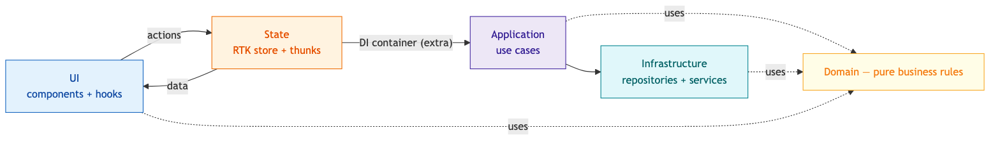

# RTK + DI Skeleton

A minimal, framework-agnostic reference implementation of a **Clean-Architecture + Redux Toolkit** pattern: layered `domain` / `services` / `repositories` / `use-cases`, with a **dependency-injection container** injected into thunks via custom middleware.

It is a distilled, anonymized version of a production checkout/cart architecture. It demonstrates a full vertical slice for a shopping cart and applies the **right tool per data type**:

- **Cart** (optimistic writes + server reconciliation) → `createAsyncThunk` + a hand-rolled **DI container** + repository/use-case layers.
- **Catalog** (read-only, cacheable server data) → **RTK Query**.
- **Realtime** (server-pushed cart updates) → a **WebSocket middleware** + a DI-injected socket service.

It's a **client-side SPA** with **React Router** (Data Mode: `createBrowserRouter` + `<RouterProvider>`) routing between a catalog page and a cart page under a shared layout.

Built on the latest **Redux Toolkit 2.x** + **react-redux 9.x** + **React Router 7.x**, using current idioms: `combineSlices`, `createEntityAdapter` + `getSelectors`, `createListenerMiddleware` for reactive side effects, RTK Query, a custom WebSocket middleware, the middleware `Tuple` callback form (`.prepend`/`.concat`), and pre-typed hooks via `.withTypes` (`useAppDispatch` / `useAppSelector`). Fully unit-tested with **Vitest** (incl. components + routing).

> This project follows the official [@reduxjs/toolkit agent skills](https://tanstack.com/intent/registry/%2540reduxjs%252Ftoolkit) — see [Alignment with official RTK skills](#alignment-with-official-rtk-skills).

## Run it

```bash
pnpm install
pnpm dev            # start Vite dev server
pnpm typecheck      # tsc --noEmit
pnpm build          # typecheck + production build
pnpm test           # run the Vitest suite once
pnpm test:watch     # watch mode
pnpm lint           # Biome: lint + format check (no writes)
pnpm lint:fix       # Biome: apply safe lint fixes + format
pnpm format         # Biome: format only
```

> This project uses **pnpm** as its package manager (pinned via the `packageManager` field for Corepack, and enforced by an `only-allow pnpm` preinstall guard). Enable it with `corepack enable pnpm`, or install via `npm i -g pnpm`.

Open the app: the header nav routes between **Catalog** (`/`) and **Cart** (`/cart`). Add items, change quantities. Watch the Redux DevTools / console (redux-logger) to see the flow. The header shows a live realtime indicator; in dev a simulated socket periodically pushes server events (see [Realtime channel](#realtime-websocket-channel)).

## The core idea

```
UI component
  → domain hook            (useCart / useItems)      // the only Redux touchpoint
    → thunk                (createAsyncThunk)         // thin: selectors in, use case out
      → DI container       (injected as `extra`)      // resolves dependencies lazily
        → use case         (application logic)        // business orchestration
          → repository     (persistence + reconcile)  // localStorage + API
            → service      (I/O: HTTP / SDK / storage)
  ← slice.extraReducers    (fan result across slices: items, totals, status, cartIdKey)
  ← selectors              (memoized, entity adapters) → component re-renders
```

A `createListenerMiddleware` listener runs after reducers to auto-sync the cart with the server (debounced) whenever items change. A separate WebSocket middleware pushes server-initiated updates *into* the store (see [Realtime channel](#realtime-websocket-channel)).

## Architecture diagram

A **one-way data flow** across four layers, with the pure **Domain** used by all of them: the UI dispatches **actions** and reads **data** back; the store hands work to **use cases** through the **DI container**; use cases talk to **infrastructure** (repositories + services).



> Source: [`docs/architecture.mmd`](docs/architecture.mmd) — run `pnpm diagram` to regenerate the PNG/SVG.

## Layers

| Layer | Folder | Rule |
|-------|--------|------|
| **Domain** | `src/domain/` | Pure types + business logic. No Redux, no I/O. |
| **Services** | `src/services/` | Factory functions wrapping I/O (HTTP, localStorage, WebSocket). |
| **Repositories** | `src/repositories/` | Persistence + API orchestration (+ error reconciliation). |
| **Use cases** | `src/use-cases/` | Application logic. Orchestrate services/repos + domain. |
| **Container** | `src/container.ts` | DI registry; resolves the above lazily via getters. |
| **Store** | `src/store/` | RTK slices, thunks, listener + thunk + socket middleware, selectors, hooks. |
| **Server cache** | `src/store/catalog/catalogApi.ts` | RTK Query api slice for read-only catalog data. |
| **Realtime** | `src/store/realtime/`, `src/store/middlewares/socketMiddleware.ts` | WebSocket lifecycle + server-pushed events. |
| **Routing** | `src/routes/` | React Router SPA: route config, layout + pages (the app shell). |
| **UI** | `src/components/` | Dumb components that only talk to domain hooks / RTK Query hooks. |
| **Test support** | `src/test-support/` | `asMock`, domain factories, a test-store builder, and a render helper (Vitest). |

Each layer, why it exists, and what it looks like:

### Domain — `src/domain/`

**Why:** the business rules are the most valuable, longest-lived part of the app, so they're kept as pure functions with **zero** dependencies on React, Redux, or I/O. That makes them trivially unit-testable and reusable from anywhere (hooks, thunks, use cases). Related functions are grouped into a namespace so callers read them as `CartDomain.hasItems(...)`.

```ts
// src/domain/cart/CartItem.ts — pure: no Redux/React/I/O imports
export const lineTotal = (item: CartItem): number => item.price * item.quantity
export const canDecrement = (item: CartItem): boolean => item.quantity > 1

// src/domain/cart/index.ts — grouped into a namespace
export * as Cart from './Cart'
export * as CartItem from './CartItem'
```

### Services — `src/services/`

**Why:** every side-effect (HTTP, `localStorage`, WebSocket) is isolated behind a small **factory** that receives its dependencies and returns an object of methods. Because the shape is an interface (`ReturnType<typeof …Impl>`), it's swappable — a real HTTP client in prod, a fake in tests — without touching callers.

```ts
// src/services/cartApiService.ts — a factory: (deps, options) => methods
export const CartApiServiceImpl = (_deps: Dependencies, { config }: Options) => {
  const getCart = (cart: CartDomain.Cart) => settle(cart)
  const updateCart = (cart: CartDomain.Cart) => settle(cart)
  return { getCart, updateCart }
}
export type CartApiService = ReturnType<typeof CartApiServiceImpl>
```

### Repositories — `src/repositories/`

**Why:** something has to combine persistence (storage) with the API and own the **reconciliation** rule — when the server rejects a mutation but returns the authoritative cart, merge + persist it so the store self-heals. Use cases shouldn't know `localStorage` exists; the repository hides it.

```ts
// src/repositories/cartRepository.ts
const runReconcilableAction = async (cart, action) => {
  try {
    return storeCart(await action())            // success → persist server truth
  } catch (e) {
    const error = e as ServerError
    if (error.cartFromServer) {                 // server returned truth on failure
      const reconciled = CartDomain.reconcileFromError(cart, error.cartFromServer)
      storeCart(reconciled)
      error.cartFromServer = reconciled
    }
    throw error                                 // re-throw → thunk rejects, store heals
  }
}
```

### Use cases — `src/use-cases/`

**Why:** the "what should happen when a user does X" logic lives here, orchestrating domain functions and repositories — framework-free, so it's testable without a store or React. Use cases are factories too, so they can declare their own dependencies.

```ts
// src/use-cases/cart/addItem.ts — application logic, no Redux
export const AddItemImpl =
  (_deps: Dependencies) =>
  (product: Product, allItems: CartItem[], maxItems: number): CartItem => {
    if (allItems.length >= maxItems) throw new MaxItemsReachedError()
    const existing = allItems.find(i => ProductDomain.refersToSameItem(product, i))
    return existing
      ? CartItemDomain.incrementQuantity(existing, 1) // bump quantity…
      : ProductDomain.toCartItem(product, 1)          // …or add a new line
  }
```

### Container — `src/container.ts`

**Why:** one place wires implementations to names. Entries are **lazy singletons** resolved through getters, so factories can reference each other without worrying about declaration order (`cartRepository` transparently pulls in the services it needs). Tests swap this whole registry for mocks; prod swaps a fake service for a real one.

```ts
// src/container.ts
const dependencies = {
  cartApiService: singleton(CartApiServiceImpl),
  cartRepository: singleton(CartRepositoryImpl), // builds on cartApiService + storage
  addItem: AddItemImpl
}
// resolved lazily: `container.cartRepository` is built on first access
```

### Store — `src/store/`

**Why:** the single state tree and the plumbing around it. Thunks stay **thin** — read state via selectors, delegate the real work to a use case (injected as `extra`), and let `extraReducers` fold the result in. Actions are **event-style** ("something happened"), and selectors are the only read API.

```ts
// src/store/cart/thunks/addItem.ts — thin: selectors in, use case out
export const addItem = createAsyncThunk<CartItem, Product, ThunkCfg>(
  'cart/items/addItem',
  (product, { getState, extra }) =>
    extra.addItem(product, getAllItems(getState()), getConfig(getState()).maxItems)
)

// src/store/cart/items.ts — the slice folds the result into normalized state
builder.addCase(addItem.fulfilled, itemsAdapter.upsertOne)
```

### Server cache — `src/store/catalog/catalogApi.ts`

**Why:** read-only, cacheable data (the catalog) doesn't need optimistic writes, DI, or reconciliation — so it skips the thunk path entirely. **RTK Query** gives caching, request dedupe, and auto-generated hooks for free.

```ts
// src/store/catalog/catalogApi.ts
export const catalogApi = createApi({
  reducerPath: 'catalogApi',
  baseQuery: fakeBaseQuery(),                    // swap for fetchBaseQuery to go live
  endpoints: build => ({
    getProducts: build.query<Product[], void>({ queryFn })
  })
})
export const { useGetProductsQuery } = catalogApi
```

### Realtime — `src/store/realtime/` + `socketMiddleware.ts`

**Why:** server-initiated updates need something to own the connection **lifecycle** (a middleware) and a swappable **service** (real socket in prod, simulated in dev/tests). Incoming pushes are dispatched as ordinary actions, so the reducers that already handle fetch results handle realtime updates too — no special path.

```ts
// src/store/cart/items.ts — a WebSocket push reuses the same reducer
builder.addCase(realtimeMessageReceived, (state, action) => {
  if (action.payload.type === RealtimeDomain.CART_UPDATED)
    setAllFromCart(state, action.payload.cart)
})
```

### Routing — `src/routes/`

**Why:** routes are declared as **plain data** (React Router "Data Mode"), kept separate from `createBrowserRouter` so tests can feed the exact same tree into `createRoutesStub`. Pages nest under a `RootLayout` that renders the shared shell + `<Outlet/>`.

```ts
// src/routes/routes.tsx
export const routes: RouteObject[] = [{
  path: '/', Component: RootLayout,
  children: [
    { index: true, Component: CatalogPage },
    { path: 'cart', Component: CartPage },
    { path: '*', Component: NotFoundPage }
  ]
}]
```

### UI — `src/components/`

**Why:** components are **dumb** — they only call hooks (domain hooks or RTK Query hooks) and render. No Redux imports, no business logic, no I/O. That keeps them easy to test and restyle, and pushes decisions into the domain (see [Domain helpers in practice](#domain-helpers-in-practice)).

```tsx
// src/components/Catalog.tsx
const { items, addItem } = useItems()
const { data: products = [] } = useGetProductsQuery()
// ...
<button type="button" onClick={() => addItem(product)}>
  {ProductDomain.isInCart(product, items) ? 'Add another' : 'Add'}
</button>
```

### Test support — `src/test-support/`

**Why:** tests run against a **real** store wired exactly like production (custom `thunkWithContainer` + RTK Query middleware), with only the DI container swapped for a mock — so they exercise the true middleware chain while injecting just the deps under test. Factories keep fixtures DRY.

```ts
// src/test-support/store.ts — real store, mocked DI seam
const store = makeTestStore({ container: { addItem: AddItemImpl({}) } })
// assert on real resulting state, not on dispatched-action logs
```

## Domain helpers in practice

Business rules live as small, pure functions on a domain "namespace"
(`export * as Cart from './Cart'`), and the UI reaches for them by name —
`CartDomain.hasItems(...)`, `ProductDomain.isInCart(...)` — instead of inlining
the logic. The rule is defined and unit-tested once; components stay dumb.

Where and how they show up:

| Helper | Defined in | Used by | Why it's a helper (not inline) |
|--------|-----------|---------|-------------------------------|
| `Cart.hasItems` / `Cart.isEmpty` | `domain/cart/Cart.ts` | `useCart` → `CartView` empty state | One definition of "empty", named for intent. |
| `Cart.canCheckout` | `domain/cart/Cart.ts` | `useCart` → `CartView` Checkout button | **Composes** `isLoaded && hasItems && !isCompleted` so the "can I check out?" rule lives in one place. |
| `CartItem.canDecrement` | `domain/cart/CartItem.ts` | `CartView` "−" button | Mirrors the quantity-clamp rule; disables the control instead of dispatching a no-op. |
| `CartItem.isFree` | `domain/cart/CartItem.ts` | `CartView` line total | Drives "Free" labelling for zero-priced lines. |
| `Product.quantityInCart` / `Product.isInCart` | `domain/catalog/Product.ts` | `Catalog` badge + button label | Answers catalog↔cart questions via the shared `refersToSameItem` rule, not ad-hoc `.find()` in JSX. |

The pattern to copy: a hook selects raw state, then derives named booleans/values
with domain helpers before returning them, e.g.

```ts
// src/store/cart/hooks/useCart.ts
const totalItems = useSelector(getTotalItems)
const status = useSelector(getCartStatus)

return {
  hasItems: CartDomain.hasItems(totalItems),
  isEmpty: CartDomain.isEmpty(totalItems),
  canCheckout: CartDomain.canCheckout(status, totalItems) // composed rule
}
```

Components then read the flag (`const { canCheckout } = useCart()`) and never
re-implement the condition. Every helper has a matching unit test colocated
beside its source (e.g. `Cart.ts` + `Cart.test.ts`), so the rules are verified
independently of React.

## How the DI container works

`src/container.ts` holds a registry of **factories**. Each is called with `(container, options)`. The container resolves entries lazily through getters, so factories can reference each other without worrying about order:

```ts
cartRepository: singleton(CartRepositoryImpl)  // pulls in cartApiService + browserStorageService
```

The container is built once — by the `thunkWithContainer` middleware — after `app.isInitialized` is set (so it can read runtime `config` from the store).

## How thunks get their dependencies

The default redux-thunk is **disabled** (`getDefaultMiddleware({ thunk: false })`). Our `thunkWithContainer` middleware replaces it and injects the container as the thunk `extra` argument:

```ts
// src/store/middlewares/thunkWithContainer.ts
if (typeof action === 'function') {
  return action(store.dispatch, store.getState, container)
}
```

So every thunk is typed with `extra: Container` and stays thin:

```ts
// src/store/cart/thunks/addItem.ts
export const addItem = createAsyncThunk<CartItem, Product, { extra: Container; ... }>(
  'cart/items/addItem',
  (product, { getState, extra, rejectWithValue }) => {
    const allItems = getAllItems(getState())
    const { maxItems } = getConfig(getState())
    try { return extra.addItem(product, allItems, maxItems) }
    catch (e) { return rejectWithValue((e as Error).message) }
  }
)
```

### Why the built-in thunk is disabled

Disabling `thunk` is **not** about removing thunk behavior — it's about swapping in
a thunk middleware that also does **dependency injection**. Stock redux-thunk calls
`action(dispatch, getState, extraArgument)` where `extraArgument` is a single, fixed
value passed once at store-creation time. That isn't enough here because:

1. The `extra` (the DI `Container`) must be built **lazily** — only after
   `app.isInitialized` is true, since it reads runtime `config` out of the store.
2. Every thunk pulls its use-cases/repositories/services from that container
   (`extra.loadCart()`, `extra.addItem(...)`, etc.).

So `thunkWithContainer` constructs the container on demand and injects it. This
mirrors the source (gopay) architecture.

Consequences:

- Every thunk is typed with `extra: Container`.
- **RTK Query still works** despite `thunk: false`, because `thunkWithContainer`
  executes *any* function action — including RTK Query's internal thunks. That's
  why `catalogApi` functions correctly.

### Should you keep it?

In this repo, **yes** — it's load-bearing. It's the mechanism that makes the DI
container reach the thunks. Reverting to the default thunk would break injection
unless you refactored how thunks obtain their dependencies.

Trade-offs to be aware of:

- **Type-safety leak.** Because the store no longer *knows* it has a thunk
  middleware, RTK can't infer a thunk-aware dispatch type — hence the manual
  `AppDispatch` declaration described in [Typed hooks](#typed-hooks-react-redux-9)
  below. It's accurate, but it's an assertion the store doesn't prove, so keep a
  comment/test so it doesn't silently drift.
- **You're maintaining middleware RTK gives you for free.** The default
  `extraArgument` mechanism covers most DI needs; the custom middleware only earns
  its keep because of the *lazy, state-derived* container construction.

### The simpler alternative

If you didn't need the container built lazily from store state, you could delete
`thunkWithContainer` entirely and use the stock feature:

    getDefaultMiddleware({ thunk: { extraArgument: makeContainer(config) } })

Then `extra` is the container in every thunk, dispatch stays correctly typed
automatically, and you write zero custom middleware. The catch: `config` must be
available at store-creation time (e.g. `makeStore(config)` in `main.tsx`) instead
of being read from a `bootstrap` action after the store exists.

**Summary:** keep the custom middleware if faithful replication of the gopay
lazy-DI pattern is the goal (it is, for this project); switch to the built-in
`extraArgument` if you'd prefer simpler, fully-inferred types and can resolve
config before the store is created.

## Is there a more modern way to do the DI?

Short version: there is **no newer official DI mechanism** in RTK. The modern,
idiomatic seam is still the built-in thunk's **`extraArgument`**. What's notable
about this repo is that it *replaces* the thunk middleware (`thunkWithContainer`)
mainly to get one thing `extraArgument` doesn't give you out of the box: **lazy,
state-derived container construction**. So "is there a better way?" really comes
down to whether you still need that laziness.

### What forces the custom middleware today

The container needs `config`, and `config` only exists **after** the `bootstrap`
action runs, so it's built lazily inside the middleware:

```ts
// src/store/middlewares/thunkWithContainer.ts
if (getIsInitialized(state) && !container) {
  container = createContainer({ config: getConfig(state) })
}
```

That "build after the store exists, from store state" requirement is the *only*
reason the stock mechanism doesn't fit. It also has two costs:

1. The built-in thunk is disabled (`thunk: false`), so RTK can't infer a
   thunk-aware dispatch — hence the hand-declared `AppDispatch` in
   `src/store/index.ts`.
2. You maintain middleware RTK would otherwise give you for free.

### Option A — Built-in `extraArgument` (recommended, most standard)

If `config` can be resolved **before** the store is created (in an SPA it usually
can — env vars, a top-level `await`, or a fetch in `main.tsx`), this is the
cleanest, most current approach:

```ts
// main.tsx
const config = await loadConfig()          // resolve first
const store = makeStore(config)

// store.ts
configureStore({
  reducer: rootReducer,
  middleware: (gdm) =>
    gdm({ thunk: { extraArgument: makeContainer({ config }) } })
      .prepend(listenerMiddleware.middleware)
      .prepend(socketMiddleware())
      .concat(catalogApi.middleware),
})
```

Wins: delete `thunkWithContainer` entirely, `AppDispatch` becomes **inferred**
again (no manual `ThunkDispatch` declaration), and it's exactly the pattern the
RTK docs + `modern-redux` skill recommend. Thunks keep `extra: Container`
unchanged.

### Option B — Keep laziness, but via `extraArgument` (still no custom middleware)

If you *must* defer construction, pass a **lazy container** as the extra argument
(a `Proxy`, or a holder that builds on first access) — you keep the "build once,
later" behavior while using the standard seam:

```ts
const lazyContainer = new Proxy({} as Container, {
  get(_t, prop) {
    built ??= makeContainer({ config: getConfigSomehow() })
    return built[prop as keyof Container]
  },
})
gdm({ thunk: { extraArgument: lazyContainer } })
```

The tricky bit is `getConfigSomehow()` needing the store (chicken-and-egg) — a
mutable ref populated right after `configureStore` solves it. Works, but Option A
is cleaner; deferring is usually an artifact of the `bootstrap`-action pattern,
not a hard requirement.

### Option C — Decouple DI from Redux (React Context)

A genuinely different direction: provide the container through **React Context**
and consume it in hooks, instead of threading it through thunk `extra`:

```tsx
const ContainerContext = createContext<Container | null>(null)
export const useContainer = () => useContext(ContainerContext)!
```

Good if you want services usable *outside* Redux (components, RTK Query `queryFn`,
route loaders). The cost: thunks lose the `extra` injection point, so orchestration
moves into hooks/use-cases called from components — a bigger shift that moves away
from the "thin thunk → use case" story this skeleton is built around. Only worth it
if you routinely need services well outside the Redux flow.

### On the container implementation itself

The hand-rolled registry (memoized `singleton` + getter-based lazy resolution in
`src/container.ts`) is fine and dependency-free. You *could* swap it for a mature
DI library — `awilix` (which the source architecture's `asValue`/container naming
echoed), `tsyringe`, or InversifyJS — but it's not recommended here: RTK's own
guidance is that you rarely need a DI library, the current version is ~15 lines
with full type inference (`Container` is derived from the registry), and
decorator-based containers (tsyringe/Inversify) drag in `reflect-metadata` and a
heavier toolchain for no real gain.

### Recommendation

| Approach | When | Effect |
|----------|------|--------|
| **A: built-in `extraArgument`** | You can resolve `config` before store creation | Deletes custom middleware, restores inferred `AppDispatch`, matches official guidance — a net simplification. |
| **B: lazy proxy as `extraArgument`** | You must defer, but want the standard seam | No custom middleware, but the store-ref dance is fiddly. |
| **C: React Context DI** | Services needed broadly outside Redux | Decouples DI from Redux; abandons the thin-thunk pattern. |
| **Keep current `thunkWithContainer`** | Faithfully teaching the gopay lazy, state-derived pattern (this repo's goal) | Already the right pattern — nothing newer to adopt. |

Bottom line: it's not a newer *API*, it's a simpler *arrangement* — lean on
`thunk.extraArgument` instead of hand-rolling the middleware, unless the
lazy-from-state behavior is a deliberate teaching goal (it is here).

## Typed hooks (react-redux 9)

Because we disabled the built-in thunk, the store's inferred dispatch type is
*not* thunk-aware. We declare `AppDispatch` manually to match runtime reality
(our middleware accepts thunks and injects the `Container` as `extra`) and build
pre-typed hooks with `.withTypes`:

```ts
// src/store/index.ts
export type AppDispatch = ThunkDispatch<State, Container, UnknownAction>

// src/store/hooks.ts
export const useAppDispatch = useDispatch.withTypes<AppDispatch>()
export const useAppSelector = useSelector.withTypes<State>()
```

`useAction` dispatches through `useAppDispatch`, so components dispatch thunks
with full type-safety and zero casts.

## Store composition

The root reducer nests focused slices; `cart` is itself composed of sub-slices so a single async result can fan out across several of them:

```
app        → { isInitialized }
config     → runtime Config
realtime   → { status, lastEvent }        // WebSocket connection state
cart
  items    → entity adapter (normalized line items)
  totals   → { subTotal, tax, grandTotal, loading }
  status   → INITIAL | LOADING | NOT_SUBMITTED | FINISHING | COMPLETED | FAILURE
  cartIdKey → server cart id
catalogApi → RTK Query cache (read-only catalog)
```

Composed with `combineSlices(appSlice, configSlice, realtimeSlice, { cart, catalogApi })`.

## Routing (SPA)

The app is a client-side SPA using **React Router in Data Mode**
(`createBrowserRouter` + `<RouterProvider>`). The SPA how-to's own guidance:
Framework Mode owns the `ssr:false` "SPA Mode"; in **Data/Declarative mode you
design your own SPA architecture** — which is what this is (a plain Vite build, no
framework Vite plugin, no SSR).

```
/            → CatalogPage   (index route)
/cart        → CartPage
*            → NotFoundPage
             all nested under RootLayout (shared shell + <Outlet/>)
```

| File | Role |
|------|------|
| `src/routes/routes.tsx` | Route tree as plain objects — exported so tests reuse it. |
| `src/routes/router.ts` | `createBrowserRouter(routes)` for the browser. |
| `src/routes/RootLayout.tsx` | The **application shell**: owns one-time bootstrap (config + `loadCart` + realtime connect), renders the nav + realtime badge, and an `<Outlet/>`. |
| `src/routes/CatalogPage.tsx` / `CartPage.tsx` / `NotFoundPage.tsx` | Page components — thin wrappers over the reusable `components/`. |

Why this shape:

- **One layout route owns bootstrap.** App initialization moved out of a
  top-level `App` component into `RootLayout` (the shell), so it runs once no
  matter which URL you deep-link into.
- **Pages stay thin.** `CatalogPage`/`CartPage` just compose the existing dumb
  components (`Catalog`, `CartView`) — routing is orthogonal to the data
  architecture, and the components didn't have to change.
- **`main.tsx`** renders `<Provider store={store}><RouterProvider router={router} /></Provider>` —
  Redux wraps the router, so every route has store access.

## Data flow: "add to cart"

1. `Catalog` calls `addItem(product)` from the `useItems` hook.
2. `addItem` thunk reads selectors, delegates to `extra.addItem` (use case).
3. `AddItemImpl` enforces the max-items rule and returns a new/updated `CartItem`.
4. `items` slice `extraReducers` folds it in via `upsertOne`.
5. The listener middleware matches the cart-item action → **debounced** (`cancelActiveListeners` + `delay`) `dispatch(updateCart())`.
6. `updateCart` thunk sends the whole cart via the repository → service, which
   recomputes totals + tax and returns the authoritative cart.
7. `totals` / `cartIdKey` slices update from the result; the UI re-renders.

(The catalog is loaded separately by RTK Query's `useGetProductsQuery` — cached, deduped, no thunk/DI involved.)

## Realtime (WebSocket) channel

The three data models each get the right tool: **cart** = thunk + DI (optimistic
writes), **catalog** = RTK Query (read cache), **realtime** = a dedicated
**WebSocket middleware**. Where thunks pull data *out* of the server on demand,
the socket pushes updates *in* (e.g. the cart was edited in another tab, or a
price changed server-side).

Pieces:

| Piece | File | Responsibility |
|-------|------|----------------|
| **Domain** | `src/domain/realtime/RealtimeEvent.ts` | `RealtimeEvent` union, `ConnectionStatus`, and a pure `parse`/`serialize` for socket frames. |
| **Service** | `src/services/webSocketService.ts` | DI-injectable wrapper over the native `WebSocket` (the `WebSocket` ctor is injected so tests pass a fake). |
| **Mock service** | `src/services/simulatedWebSocketService.ts` | Same shape; fakes server pushes so the demo works with no backend. |
| **Middleware** | `src/store/middlewares/socketMiddleware.ts` | Owns the connection lifecycle; turns socket callbacks into actions. |
| **Slice** | `src/store/realtime/index.ts` | Connection status + last event; command/event actions. |
| **Hook** | `src/store/realtime/useRealtime.ts` | The only realtime touchpoint for components. |

Data flow (server → store):

1. `RootLayout` (the shell) dispatches `realtimeConnectionRequested()` (a **command** action) on mount.
2. `socketMiddleware` sees it, builds a `WebSocketService` (reading `config.socketUrl`
   from state, same lazy pattern as the DI container), and opens the socket.
3. Socket callbacks become **event** actions: `realtimeConnected`,
   `realtimeDisconnected`, and `realtimeMessageReceived(event)`.
4. Reducers own the transitions: the `realtime` slice tracks status/last event,
   and — for a `cartUpdated` push — the cart sub-slices (`items` / `totals` /
   `cartIdKey`) fold the authoritative cart in via `extraReducers`. Same fan-out
   as a thunk result; the source is just a socket instead.

Design choices, and why:

- **Command vs. event actions.** The UI dispatches *intents*
  (`realtimeConnectionRequested`, `realtimeDisconnectRequested`); the middleware
  performs the imperative socket work and dispatches *facts* (`…Connected`,
  `…MessageReceived`). Reducers only ever react to facts — no side effects in
  reducers, no socket handles in components.
- **The socket service is injectable.** `socketMiddleware({ createService })`
  takes a factory (defaulting through the same service factories the DI container
  uses), so tests swap in a fake with zero globals — see
  `socketMiddleware.test.ts` and `webSocketService.test.ts`.
- **Middleware vs. `createListenerMiddleware`.** RTK's `handle-side-effects`
  skill would also accept a listener with a long-running `fork` task for the
  socket. A dedicated middleware is used here because it keeps the connection
  handle and lifecycle in one obvious place and mirrors the classic Redux
  WebSocket-middleware pattern. (The debounced cart *sync* still uses the
  listener middleware — right tool per job.)

> **Note on the source architecture:** the original app has **no** WebSocket
> middleware — its realtime/broadcast concerns live server-side (SNS/SQS) and its
> only browser messaging is `postMessage` (iframe embedding). This channel is a
> faithful *extension* of the same DI + middleware patterns, not a port.

To go live, drop the simulated service and point `config.socketUrl` at a real
endpoint; `WebSocketServiceImpl` already speaks the native `WebSocket` API.

## Error reconciliation

`cartRepository.runReconcilableAction` demonstrates a key resilience pattern: if
the server rejects a mutation but returns the authoritative cart in the error,
the repo merges + persists it and re-throws. The rejected thunk carries that cart
as its `rejectValue`, and slices apply it in `*.rejected` reducers so the UI
self-heals. (The mock service never fails, but the wiring is there.)

## Swapping the mock for a real backend

`src/services/cartApiService.ts` currently simulates a server (computes totals
locally after a delay). To go live, inject `requestService` and replace the
method bodies with real calls, e.g.:

```ts
const updateCart = (cart) =>
  requestService.post<Cart>(`${config.cartApiBaseUrl}/carts`, cart)
```

Register `requestService` as a dependency of `cartApiService` in `container.ts`
and nothing else has to change.

## Testing

Unit-tested end-to-end with **Vitest** (jsdom environment). The test harness is
ported from the source architecture's Jest setup — same patterns, Vitest APIs:

```bash
pnpm test            # run once
pnpm test:watch      # watch mode
pnpm test:coverage
```

**Test support** (`src/test-support/`) — the reusable harness:

| Helper | File | Purpose |
|--------|------|---------|
| `asMock<T>(partial)` | `asMock.ts` | Cast a partial mock to its full type — provide only the methods a test touches. (Ported from the source's `test/asMock` + `RecursivePartial`.) |
| Domain factories | `factories.ts` | `createCart`, `createCartItem`, `createProduct`, `createConfig`, … valid objects with overridable defaults. |
| `makeTestStore(...)` | `store.ts` | A **real** store wired like production, but with the DI container swapped for a mock via `thunkWithContainer`'s `createContainer` seam. `app.isInitialized` is preloaded so the container builds. |
| `renderWithStore(ui, …)` | `render.tsx` | Renders a component inside a mock-container store `<Provider>`; returns the store so tests can drive/assert state. |
| `setup.ts` | `setup.ts` | jest-dom matchers + cleanup between tests. |

**What's covered, and how each layer is tested:**

Tests are **colocated** with the code they cover — `Foo.ts` sits next to `Foo.test.ts` (no `__tests__/` folders) — so a module and its spec move and refactor together.

- **Domain** (`src/domain/**/*.test.ts`) — pure functions, no mocks
  (`CartItem`, `Cart`, `Product`, `RealtimeEvent`).
- **Use cases** — inject `asMock`-ed repositories, assert delegation + rules
  (`addItem` max-items rule; `loadCart`/`updateCart` forwarding).
- **Repository** — `asMock` services; asserts persistence + the server-error
  **reconciliation** path.
- **Services** — `cartApiService` totals/tax math; `browserStorageService`
  against jsdom `localStorage`; `webSocketService` with an **injected fake
  `WebSocket`** (mirrors how the source tests `messageService` with a fake
  `window`).
- **Slices** — reducers + `extraReducers` driven directly with actions, incl.
  thunk lifecycle actions (`addItem.fulfilled(...)`) and realtime pushes.
- **Selectors** — `getCartEntity` recomposition from sub-slices.
- **Thunks** — dispatched through `makeTestStore` with a mock container; asserts
  the container arrives as `extra` and the result folds into real state.
- **Middleware** — `socketMiddleware` with an injected fake socket service;
  asserts command→lifecycle→event action wiring.
- **Components** (`src/components/*.test.tsx`) — Testing Library + `renderWithStore`.
  `Catalog` (RTK Query load + add-to-cart through the thunk/DI path), `CartView`
  (quantity/remove interactions), `RealtimeBadge` (status reflection).
- **Routing** (`src/routes/*.test.tsx`) — the RR-recommended **`createRoutesStub`**
  fed the app's real `routes` tree (wrapped in the store `<Provider>`): asserts
  each page renders at its path, nav-link navigation, and the splat 404.

The DI seams are what make this cheap: every dependency is a factory, so tests
inject fakes without module mocking or globals. Components get the same treatment
via `renderWithStore`; router-aware components use `createRoutesStub`.

Component tests follow [React Testing Library best practices](https://kentcdodds.com/blog/common-mistakes-with-react-testing-library):
`screen` for all queries, `*ByRole` with accessible names where possible (text
for content), `find*` (not `waitFor`) for async UI, `@testing-library/user-event`
for interactions, jest-dom assertions, `query*` reserved for non-existence, and
no manual `cleanup` or unnecessary `act` (presentational components are tested
via preloaded state, not by dispatching and asserting a re-render).

## Tooling: linting, formatting & git hooks

Code quality is enforced by [Biome](https://biomejs.dev/) (a single fast tool for
linting *and* formatting, replacing ESLint + Prettier) and wired into git via
[Husky](https://typicode.github.io/husky/) + [lint-staged](https://github.com/lint-staged/lint-staged),
with commit messages validated by [commitlint](https://commitlint.js.org/).

- **`biome.json`** — configured to match the existing house style so adopting it
  caused near-zero churn: single quotes, no semicolons, 2-space indentation,
  no trailing commas, `double` quotes for JSX attributes. The `recommended`
  ruleset is on; import organization is left `off` to preserve the intentional,
  comment-grouped import ordering in the store/container files.
- **`.husky/pre-commit`** — runs `lint-staged`, which applies
  `biome check --write` to *staged* `.ts/.tsx/.js/.jsx/.json` files only (fast,
  and auto-restages the fixes). This keeps every commit formatted and lint-clean
  without checking the whole tree.
- **`.husky/commit-msg`** — runs `commitlint --edit`, enforcing
  [Conventional Commits](https://www.conventionalcommits.org/) via
  `@commitlint/config-conventional` (see `commitlint.config.js`). So
  `feat: add realtime badge` passes; `fixed stuff` is rejected.

Hooks install automatically on `pnpm install` through the `prepare: husky`
script. Test runs and typechecking are intentionally left out of `pre-commit`
(kept fast) — run them in CI or a `pre-push` hook if you want that gate.

## Alignment with official RTK skills

Audited against the actual `SKILL.md` files shipped inside `@reduxjs/toolkit` (`node_modules/@reduxjs/toolkit/skills/**`) — the [registry](https://tanstack.com/intent/registry/%2540reduxjs%252Ftoolkit) is just a browser for these. Run `npx @tanstack/intent@latest install` to wire them into your agent.

| Skill | How this repo applies it |
|-------|--------------------------|
| **design-state-ownership** | Right tool per data type: cart (optimistic, shared) in Redux via thunks; catalog (read cache) in RTK Query; config in a slice; small focused sub-slices; domain-named store keys (not component names); only authoritative server snapshots replace state wholesale. |
| **modern-redux** | `configureStore`, `<Provider>`, hooks-first UI, pre-typed `useAppDispatch`/`useAppSelector` via `.withTypes`, module-singleton store (correct for an SPA), no store imports in components, no `connect`. |
| **redux-dataflow** | Event-style actions (`itemQuantityChanged`, `itemRemoved`) with reducer-owned transitions; derived data via memoized selectors; no derived values stored in state. |
| **build-slices-and-selectors** | `createSlice`, `createEntityAdapter` + `getSelectors`, `combineSlices` (lazy-injection ready), Immer mutations, **builder-form** `extraReducers` (not the removed RTK 1 object form). |
| **adopt-rtk-query** | `catalogApi` via `createApi` — one API slice per base URL, `api.reducer` + `api.middleware` both wired, `tagTypes`/`providesTags`, no cache persistence, no component-level cache patching. |
| **handle-side-effects** | `createListenerMiddleware` for reactive cart-sync (debounced via `cancelActiveListeners` + `delay`), typed with `startListening.withTypes<State, AppDispatch>()`; a dedicated WebSocket middleware for the realtime channel (command actions in, event actions out); `createAsyncThunk` for imperative writes; no side effects in reducers. |
| **debug-redux-toolkit-apps** | Thunk-level `condition` guard on `loadCart` (StrictMode-safe, no duplicate fetch); serializable state only; narrow per-value selectors at the usage site. |
| **migrate-to-modern-redux** | Greenfield — already on target patterns; no `createStore`, no legacy `connect`, no removed array-middleware config form. |

### Intentional divergences from the skills

- **Folder layout.** The `modern-redux` skill suggests `app/` + `features/`. This repo uses a Clean-Architecture layout (`domain/services/repositories/use-cases/store`) on purpose — that DI structure is the point of the project. None of the skill's *actual* HIGH mistakes (store-in-components, `connect`, store lifetime) are violated.
- **Cart uses `createAsyncThunk`, not RTK Query.** The server-data skills prefer RTK Query for server cache. The cart deliberately stays on the thunk+DI+repository path because it needs optimistic local writes + explicit server-error reconciliation. Per `handle-side-effects`' own decision guidance, that's a valid `createAsyncThunk` use; RTK Query is used for the catalog where it shines. If you'd rather model the cart in RTK Query, the equivalent is `onQueryStarted` optimistic updates + `updateQueryData`.

## What was intentionally simplified vs. the source architecture

- One vertical slice (cart items) instead of the full checkout/payment/coupon set.
- A single `cartApiService` stands in for the original's split of
  `cartApiService` (read metadata) + `checkoutApiService` (cart CRUD).
- No iframe/postMessage embedding, i18n, or SSR — those are orthogonal concerns.
- The cart deliberately does **not** use RTK Query: it needs optimistic local
  mutations + explicit server-error reconciliation, which the thunk + repository
  path expresses more directly. RTK Query is used where it shines (read cache).
- The **realtime channel is an extension, not a port** — the source has no
  browser WebSocket middleware (its realtime concerns are server-side SNS/SQS).
  It's included here to show the same DI + middleware patterns applied to a
  server-push data model, backed by a simulated socket for the demo.
```
